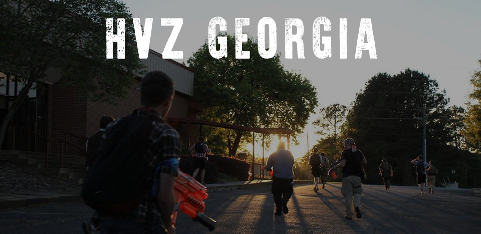

  UGA Spring Invitational

---

HvZ GA

---

This is the website to host Georgia's HvZ events eah year.

## Contact Form Information

The [contact form](./contact.html) utilizes [formspree](https://formspree.io/).

## Slideshow

The slideshow background is pretty straightforward, but there are two JS
settings you'll want to be aware of (found under "Slideshow Background" in
assets/js/main.min.js):

### Images

The list of images to cycle through, given in the following format:

* 'url': 'alignment'

Where 'url' is the image (eg. 'images/foo.jpg',
'http://somewhere.else/foo.jpg'), and 'alignment' is how the image should be
vertically aligned ('top', 'center', or 'bottom').

**Note: Browsers that don't support CSS transitions (like IE<=9) will only see the first image.**

### Delay

Delay configures how long to wait between transitions (in ms). Note that this
must be at least twice as long as the transition speed itself (currently 3 seconds).
